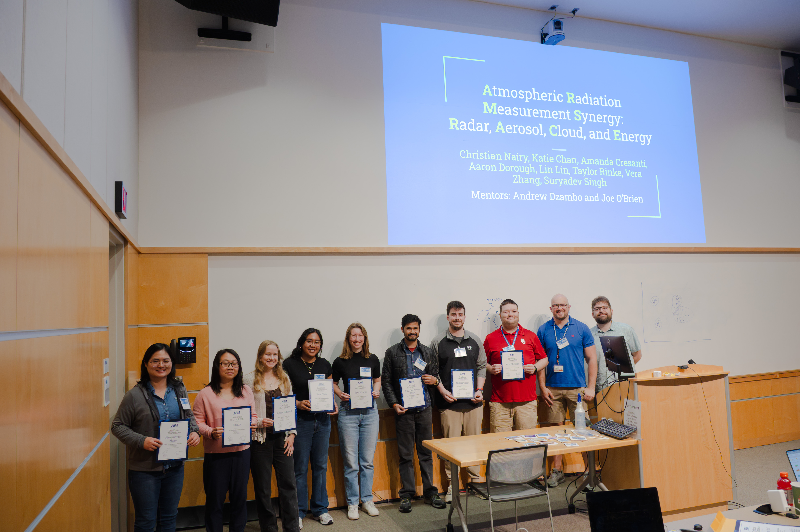

# Atmospheric Radiation Measurement Synergy: Radar, Aerosol, Cloud and Energy (ARMS-Race)

## [2026 ARM Summer School](https://arm-development.github.io/arm-summer-school-2026/) Project 

Random Forest Machine Learning Algorithm Development to Classify Arctic Cloud Phase
at ARM's [North Slope Alaska Facility](https://armgov.svcs.arm.gov/capabilities/observatories/nsa)

## Project Scope

- Mixed-phase clouds have an impact on the radiative fluxes in the Arctic
- Use ground-based and aircraft ARM Data to study clouds and preciptiation in the Arctic.
- Train and evaluate a machine learning model to classify cloud phase. 

## Final Presentation
- [Link to Final Presentation](./ARMS_RACE_final_presentation.pptx.pdf)
